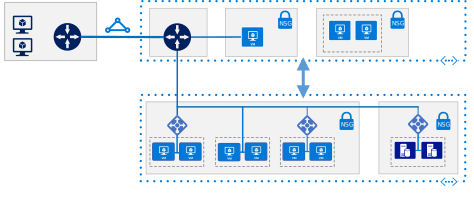

# SAP on Azure reference architectures

<ul class="panelContent">
<li style="display: flex; flex-direction: column;">
    <a href="./sap-netweaver.md" style="display: flex; flex-direction: column; flex: 1 0 auto;">
        

            

                

                    

                        

                            
                        

                    

                    

                        <h3>SAP NetWeaver for AnyDB</h3>
                        
Run SAP NetWeaver in a Windows environment on Azure with high availability. This reference architecture targets AnyDB, the SAP term for any supported DBMS besides SAP HANA.

                    

                

            

        

    </a>
</li>
</ul>
